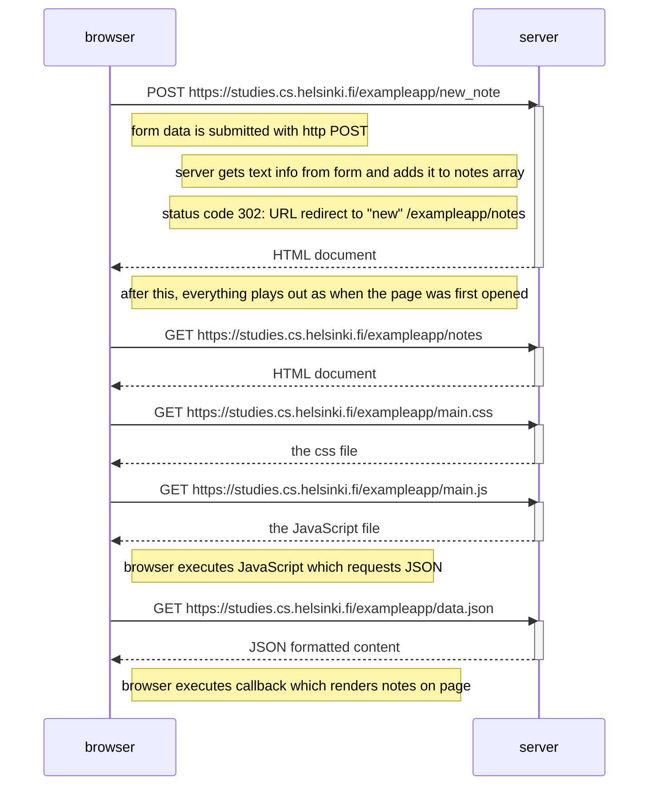

```mermaid
sequenceDiagram
    participant browser
    participant server

    browser->>server: POST https://studies.cs.helsinki.fi/exampleapp/new_note
    activate server
    
    Note right of browser: form data is submitted with http POST
    Note left of server: server gets text info from form and adds it to notes array
    Note left of server: status code 302: URL redirect to "new" /exampleapp/notes
    server-->>browser: HTML document
    deactivate server

    Note right of browser: after this, everything plays out as when the page was first opened


    browser->>server: GET https://studies.cs.helsinki.fi/exampleapp/notes
    activate server
    server-->>browser: HTML document
    deactivate server

    browser->>server: GET https://studies.cs.helsinki.fi/exampleapp/main.css
    activate server
    server-->>browser: the css file
    deactivate server

    browser->>server: GET https://studies.cs.helsinki.fi/exampleapp/main.js
    activate server
    server-->>browser: the JavaScript file
    deactivate server

    Note right of browser: browser executes JavaScript which requests JSON

    browser->>server: GET https://studies.cs.helsinki.fi/exampleapp/data.json
    activate server
    server-->>browser: JSON formatted content
    deactivate server

    Note right of browser: browser executes callback which renders notes on page
```