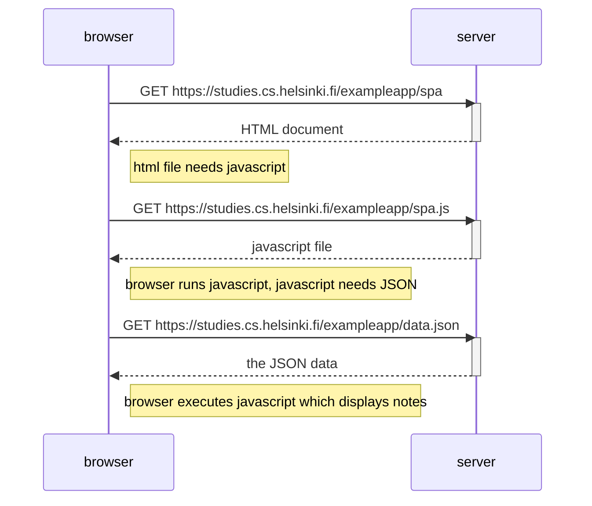

```mermaid
sequenceDiagram
    participant browser
    participant server

    browser->>server: GET https://studies.cs.helsinki.fi/exampleapp/spa
    activate server
    
    server-->>browser: HTML document
    deactivate server
    Note right of browser: html file needs javascript

    browser->>server: GET https://studies.cs.helsinki.fi/exampleapp/spa.js
    activate server
    server-->>browser: javascript file
    deactivate server
    Note right of browser: browser runs javascript, javascript needs JSON


    browser->>server: GET https://studies.cs.helsinki.fi/exampleapp/data.json
    activate server
    server-->>browser: the JSON data
    deactivate server
    Note right of browser: browser executes javascript which displays notes
```