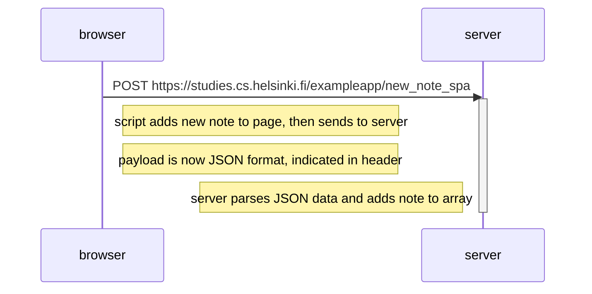

```mermaid
sequenceDiagram
    participant browser
    participant server

    browser->>server: POST https://studies.cs.helsinki.fi/exampleapp/new_note_spa
    activate server
    
    Note right of browser: script adds new note to page, then sends to server
    Note right of browser: payload is now JSON format, indicated in header
    Note left of server: server parses JSON data and adds note to array
    deactivate server
```